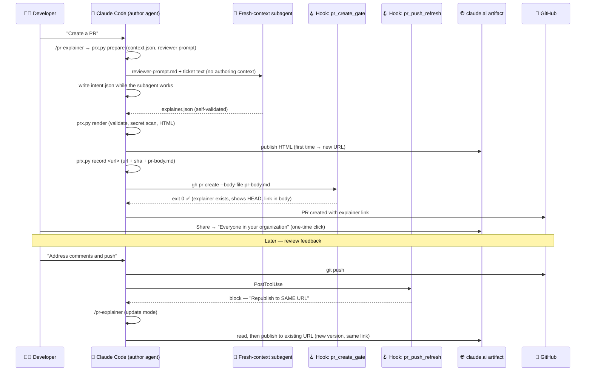

# 🧭 PR Explainer — Reference & Implementation Plan

> **Purpose of this document:** a complete reference for Claude Code to build a "PR Explainer" workflow. Every time the agent creates a PR, it generates an **interactive HTML explainer page**, publishes it as a **Claude Code artifact**, and puts the link in the PR description. Two Claude Code hooks enforce this on `gh pr create` and refresh it on `git push`.
>
> **Scope:** personal use first (one engineer, everyone assumed to be on Claude Code). No CI, no GitHub Action, no custom hosting.
>
> **Status (2026-10-08):** Phase 1 is built and dogfooded: [PR #1](https://github.com/limittox/pr-explainer/pull/1) was opened through the gate with its own explainer, and the fresh-context reviewer's findings were fixed in a follow-up commit (§11.1). Still open: confirming that native Mermaid renders in the published artifact, and that an org colleague can open a shared page.

---

## 1. 🧩 Problem statement

- Most code is now written by agents. Engineers rarely open IDEs or read code directly.
- Reviewers (especially senior engineers) can't read PRs touching thousands of files and lines.
- Reviewers rely on PR descriptions, but those are often:
  - too long and hard to digest
  - unclear about what actually changed and why
  - lacking diagrams and visual structure
  - boring, which leads to **rubber-stamp approvals**
- Industry data backs this up:
  - A 2026 study of 930k+ GitHub PRs found ~61% of AI-agent PRs got no review at all.
  - Reviewer habituation research shows reviewers become measurably more lenient over repeated agent-PR reviews.

**Goal:** make PR review *engaging* and *fast to understand*, so the reviewer grasps the shape, intent and risk of a change in a few minutes, and knows exactly where to look.

---

## 2. 💡 Ideas considered (backlog)

| # | Idea | Status |
|---|------|--------|
| 1 | 🎬 **Interactive PR explainer page.** Before/after architecture diagrams, changed components highlighted, click-to-drill-down to the code that matters | ✅ **Phase 1 built** |
| 2 | 🧠 **Quiz to approve.** A separate agent asks the reviewer 3 multiple-choice questions about the PR before approval | 🔜 Phase 3 |
| 3 | ⚖️ **Courtroom review.** A prosecutor agent argues the PR will break prod, a defence agent rebuts, and the reviewer acts as judge | Backlog |
| 4 | 🎯 **Planted bugs.** Synthetic bugs in a sandboxed copy of some PRs measure and sustain reviewer attention, like airport-scanner threat projection | Backlog |
| 5 | 🔍 **Behaviour diff.** Replay real traffic or top search queries against old vs new branch and show result diffs (great for search relevance work) | 🔜 Phase 3 |
| 6 | 🗺️ **Risk heatmap.** Score hunks by risk (auth, data writes, migrations, concurrency, config) and pre-open only the top 3 hotspots | Folded into #1 (top 3 hotspots built; heatmap view is Phase 2) |
| 7 | 📜 **Intent diff.** Show the original ticket or prompt next to what was actually built, flagging extras and omissions | Folded into #1 (built) |
| 8 | 🎧 **PR podcast.** A 3-minute audio walkthrough for commutes | Backlog |
| 9 | 📈 **Approval scorecard.** Link reverts and incidents back to the approvals that let them through | Backlog |

---

## 3. 🏛️ Architecture decisions (decision log)

### D1 — Build the interactive explainer page first (idea #1)
It changes the review interface itself, and ideas #6 and #7 fit naturally inside it.

### D2 — Run everything locally in Claude Code. No GitHub Action for now.

**Why:**
- The local agent has the richest context: the prompt, decisions, dead ends and rejected alternatives.
- There's no CI cost, no API keys and no runner minutes. It uses the developer's existing Claude plan.
- It's simpler to build and iterate on.

**Accepted trade-offs (fine for personal use):**
- PRs not created via Claude Code won't get an explainer.
- Pushes done outside Claude Code won't trigger a refresh.
- The author's agent is describing its own work (self-review bias). This is mitigated by D5.

**Revisit CI if:** this rolls out to a team, PRs show up without explainers, or a truly independent reviewer is needed. A cheap middle step is a no-LLM CI check that fails a PR if the explainer link is missing or its SHA doesn't match HEAD.

### D3 — Host on Claude Code artifacts, not GitHub Pages or GCS

**How artifacts work:**
- Claude Code publishes an HTML file from the session to a **private `claude.ai/code/artifact/<id>` URL**.
- Publishing works from the CLI or the desktop app, and requires being signed in via `/login`.
- Publishing again with the artifact's `url` creates a **new version at the same URL**, so the PR link never goes stale.
- Viewers must sign in to claude.ai as members of the **same org**. This gives org-level access control for free, with no SSO setup.

**Things that shaped the build:**
- **Check the account first.** The org is the org of the account that publishes. A personal account's "organization" may be just you, and work code would sit in a personal account. Publish from the work org account.
- **Updates from a new session must `read` the artifact before publishing to its URL**; the Artifact tool refuses otherwise. The push that triggers a refresh is usually in a new session, so the skill always reads first in update mode.
- **Claude reads any file it didn't write before publishing it.** The rendered page is about 28 KB, so this is cheap, but keep the template lean.
- **The page contract:** no doctype/html/head/body of our own (the host wraps the page), scripts only from allowlisted CDNs pinned to exact versions, stylesheets only from Google Fonts, and **Mermaid is rendered natively** from `<pre class="mermaid">`, so the page must not load Mermaid itself.

**Rejected alternatives:**
- **GitHub Pages.** Private visibility requires GitHub Enterprise Cloud. Otherwise a site built from a private repo is **public**, which would leak code.
- **GCS + Cloud Run + IAP.** A good team-scale option on GCP, but overkill for personal use.
- **Cloudflare, Vercel or Netlify with SSO.** These add a new vendor.
- **GitHub-native Mermaid comment.** Zero infrastructure, but not interactive. Kept as a fallback.

### D4 — Use a skill plus two hooks, written in Python
- **Skill `/pr-explainer`** does the real work: prepare, generate, render, publish and record the URL.
- **Hook 1 (`PreToolUse`, `Bash|PowerShell`)** blocks `gh pr create` / `gh pr new` until an explainer exists **for the current HEAD** and its link is in the PR body.
- **Hook 2 (`PostToolUse`, `Bash|PowerShell`)** tells the agent to regenerate and republish to the **same** artifact URL after a push leaves the explainer stale.
- Hooks are scripts and **cannot publish artifacts themselves**. They *nudge* the agent:
  - exit code `2` plus a stderr message blocks the call and feeds the message to Claude
  - `{"decision":"block","reason":...}` gives post-tool feedback
- **Why Python, not bash + jq:** `jq` isn't installed on the dev machine, and with `set -uo pipefail` the bash gate silently allowed everything. Python's `json` is built in and runs the same on Windows. On this machine use `python`; `python3` is the Microsoft Store stub.
- **Why `Bash|PowerShell`:** on Windows Claude often runs commands through the PowerShell tool, which a `Bash`-only matcher never sees.
- **The gate fails closed** for PR-creation commands (blocks if it can't check). **The refresh hook fails open** (it only nudges).
- **Cost:** about 110 ms of Python start-up per shell command, for each hook. A fast regex pre-check keeps the rest negligible. If that ever matters, Hook 2 can use the `if` field (`"if": "Bash(git push*)"`, one handler per tool); the gate deliberately doesn't, because `if` is documented as best-effort.

### D5 — Use a fresh-context subagent for the explainer to reduce self-review bias
- The skill spawns a **separate subagent** that receives only the git context file, the ticket or request text **verbatim**, and the repo. It does **not** get the authoring conversation, and it is told not to read `intent.json`.
- That subagent produces the diagrams, hotspots, risks and "what's missing", and checks its own output with `prx.py validate --only explainer`.
- The author agent contributes only a clearly labelled **"Author's intent (claim)"** section, written while the subagent works.
- **Rationale:** models are measurably more lenient reviewing their own output, especially when that output is wrong. A fresh context reduces this.

### D6 — The LLM writes data (JSON); a fixed, versioned renderer writes HTML
- Every PR page has the same layout, so reviewers learn where to look.
- It uses fewer tokens and runs faster.
- No LLM-authored JavaScript runs on a page containing source code.
- **Changed during the build:** `prx.py` renders the HTML in Python with every string escaped, instead of the page's JS rendering JSON. That keeps the page complete without JS, lets Mermaid blocks exist in the static HTML (required for native rendering), and leaves only ~100 lines of fixed JS for tabs, highlighting and diagram clicks.
- Mermaid source is sanitised: `click` lines and `%%{init}%%` directives are stripped, and HTML or `javascript:` in labels is rejected.

### D7 — Git facts come from git, never from the LLM
The commit SHA, base, merge-base, file and line counts, and excluded files are computed by `prx.py`. Any `commit_sha`, `base_ref` or `stats` the subagent writes is ignored. The SHA badge is the reviewer's staleness check, so it must not be able to lie.

### D8 — Large PRs: give the reviewer a map, not the whole diff
`prx.py prepare` writes a context file with stats, per-area churn, the changed files sorted by churn, and lockfiles, generated, vendored and binary files set aside (including `.gitattributes` `linguist-generated` / `linguist-vendored`). The subagent reads diffs per file on demand, risky categories first, and gets a `large` flag (over 150 files or 4,000 lines) telling it not to read everything. Passing the full diff would overflow context on exactly the PRs this exists for.

### D9 — State lives in the git common dir, keyed by branch
`<git common dir>/pr-explainer/<branch key>.*`. It's never committed, and it's shared by all worktrees of a clone, so a new worktree session on the same branch still finds the artifact URL. (Per-worktree `.git/worktrees/<name>` would lose it.)

---

## 4. 🔄 End-to-end flow



If the agent skips the skill, `gh pr create` is blocked with a message telling it to run `/pr-explainer` first, so the hook is a backstop rather than the normal path.

---

## 5. 📁 File layout

```
<repo>/
├── .claude/
│   ├── settings.json                  # hook registration
│   ├── launch.json                    # local preview server for template work
│   ├── hooks/
│   │   ├── pr_create_gate.py          # Hook 1 (PreToolUse)
│   │   └── pr_push_refresh.py         # Hook 2 (PostToolUse)
│   └── skills/
│       └── pr-explainer/
│           ├── SKILL.md               # skill instructions
│           ├── prx.py                 # prepare | validate | render | record | status, shared by the hooks
│           ├── template.html          # fixed, versioned page shell (CSS + ~100 lines of JS)
│           ├── schema.md              # JSON contract
│           ├── reviewer-prompt.md     # instructions for the fresh-context subagent
│           └── examples/              # sample intent.json + explainer.json
├── tests/test_prx.py                  # python -m unittest discover -s tests
└── <git common dir>/pr-explainer/     # local state, never committed
    ├── <key>.context.json             # git facts + file list (prepare)
    ├── <key>.reviewer-prompt.md       # filled-in subagent instructions (prepare)
    ├── <key>.intent.json              # author's intent
    ├── <key>.explainer.json           # subagent output
    ├── <key>.html                     # rendered page (republished from the same path)
    ├── <key>.rendered.json            # which commit the HTML shows
    ├── <key>.url / <key>.sha          # artifact URL and the commit it shows (record)
    └── <key>.pr-body.md               # PR body with the link and TL;DR (record)
```

`<key>` is the branch name if it's already file-name safe (`[A-Za-z0-9._-]`). Otherwise `/` becomes `__`, any other unsafe character becomes `_`, and a 6-character hash of the original name is appended, so `fix/login` and `fix__login` never share state.

---

## 6. 🪝 Hooks

Registered in `.claude/settings.json` with the exec form (`"command": "python"`, `"args": ["${CLAUDE_PROJECT_DIR}/.claude/hooks/..."]`), matcher `Bash|PowerShell`, 30 s timeout. Both hooks import `prx.py` so the command matching and state logic live in one place. They set `sys.dont_write_bytecode` so no `__pycache__` appears in the repo.

### 6.1 `pr_create_gate.py` — Hook 1 🚧

Matches `gh pr create` and `gh pr new` at the start of a command segment (after `;`, `&&`, `|`, `(`, `$(`, a newline or PowerShell's `&`), including:
- after shell keywords and wrappers: `then`, `do`, `!`, `time`, `env`, `sudo`, `xargs`, `nohup`, `exec`, `command`, `wsl`, `cmd /c`
- inside `bash -c "..."`, `sh -lc '...'`, `pwsh -Command "..."`, `iex "..."`, and heredocs fed to a shell (`bash <<'EOF'`)
- with `gh -R owner/repo ...`, `VAR=value` prefixes and full paths to `gh.exe`.

It does **not** match `echo "gh pr create"`, Markdown backticks, or anything inside a heredoc or PowerShell here-string body (commit messages and PR bodies are data). It blocks with a specific message when:

1. HEAD is detached.
2. There's no recorded artifact URL for the PR's branch → "run /pr-explainer first". The branch is the current one, or gh's own `--head` / `-H` if given.
3. The recorded SHA isn't that branch's tip → "run /pr-explainer in update mode".
3b. gh's `--base` / `-B` differs from the base the explainer was prepared against.
4. The URL isn't in the PR body: inline (anywhere except `--title`) or in the `--body-file` / `-F` file. Relative paths resolve against the hook's `cwd`; Git Bash `/c/...` paths are handled.

It runs git in the `cwd` from the hook input, not the hook's own working directory. Unreadable input, a missing `prx.py`, or a git failure all block a PR-creation command and allow everything else.

### 6.2 `pr_push_refresh.py` — Hook 2 🔁

Fires after a **successful** `git push`; failed pushes fire `PostToolUseFailure` instead, so they never reach it. It ignores `--dry-run`, `-n`, `--delete`, `-d` and `:branch` deletes. It stays silent if the branch has no explainer yet or the explainer already shows HEAD. Otherwise it returns `{"decision":"block","reason":"... republish to the SAME artifact URL ..."}`.

**Notes:**
- There is **no loop risk**: republishing doesn't run `git push`.
- Hooks only see commands **Claude** runs. Manual terminal pushes won't trigger a refresh, and a manual `gh pr create` isn't gated. That's also the escape hatch for a PR that doesn't need an explainer.
- The pushed branch is assumed to be the current branch. `git push origin other-branch` would refresh the wrong one; this is rare enough to accept.

---

## 7. 📐 Data contracts (JSON)

The full contract is in [`schema.md`](.claude/skills/pr-explainer/schema.md), with working samples in `examples/`. Changes from the first draft:

- **`intent.json`** gains a required **`short_title`** (2-4 words). It becomes the page `<title>`, which is the artifact's name, so it stays the same across updates.
- **`explainer.json`** drops `commit_sha`, `base_ref` and `stats` (D7) and adds:
  - `removed_node_ids`: nodes in `diagram_before` that are gone, drawn red and dashed
  - `components[].node_ids`: selecting that diagram box opens the component
  - `hotspots[].snippet_format`: `code` or `diff`
- Diagrams must be Mermaid **flowcharts** with simple ids, so highlighting (`classDef` + `class` lines added by the renderer) and id checks are reliable.

**Enforced by `prx.py validate` / `render` (errors stop the render):**
- At most 3 hotspots, `high` or `medium` only; snippets of 25 lines or fewer; TL;DR of 3 items or fewer.
- Every id in `changed_node_ids` / `removed_node_ids` appears in its diagram.
- Valid enums for risk and change type; required fields present.
- **Secret scan** over every string: AWS, GitHub, Slack, Google, Anthropic, OpenAI-style and Stripe keys, private keys, JWTs, passwords in URLs, Bearer/Basic auth tokens, quoted values of 6+ characters assigned to any name containing a credential word (`password`, `pwd`, `secret`, `token`, `credential`, `api_key`..., so `DB_PASSWORD="..."` and `GITHUB_TOKEN` count but `tokenizer` doesn't), and unquoted `.env` / YAML values that contain a digit. Placeholders like `<redacted>` and `${VAR}`, type words like `string`, file paths, and code references like `os.environ["API_KEY"]` pass.
- `record` refuses if either JSON file has errors, or changed after the last render, so a secret can't reach `pr-body.md` and the PR body can't drift from the published page.
- Diagram node ids can't be Mermaid keywords (`end`, `subgraph`, `class`...).
- Diagram labels: any tag other than `<br>` is an error (`<` and `>` are written `#lt;` / `#gt;`), and `click` statements are stripped wherever they appear, including after `;`.

---

## 8. 🎨 Page (template.html + renderer)

### 8.1 Page sections (in order)

1. **Header**: PR title, risk pill, commit SHA badge, `branch → base`, `+/−` counts with a five-block diff bar, ticket, and a line explaining what "Independent read" means.
2. **TL;DR**: 3 sentences max.
3. **Architecture**: Before/After tabs. Changed nodes are outlined orange and removed nodes red dashed, with a legend. Selecting a box opens its component card. On phones the diagram keeps a readable width and scrolls inside its frame.
4. **Where to look first**: up to 3 ranked hotspot cards with risk, category, why it matters, and a highlighted snippet or diff hunk. The file path links to GitHub at the exact commit and line range.
5. **Components changed**: collapsible rows with change type, summary and linked files.
6. **Intent check**: "Author's intent" with a *claim* tag in a dashed box beside a solid "Independent read" box with a verdict, extras and possibly-missing items.
7. **Test evidence**: tests added and weak spots.
8. **Before you approve**: reviewer questions (the seed for the quiz).
9. **Low risk**: one-line summaries, plus a collapsed list of files that weren't analysed and why.
10. **Footer**: template version, base and merge-base, full head SHA, render time and author.

The risk heatmap is not rendered yet (Phase 2).

### 8.2 Constraints (artifact page contract)

- The template is a **fragment**: `<title>`, `<style>`, content and scripts. The artifact host adds the doctype, head and body.
- **Mermaid is not loaded.** The host renders `<pre class="mermaid">`. `render --standalone` wraps the page in a full document and adds Mermaid 11.4.1, for local preview only.
- highlight.js 11.9.0 from cdnjs, pinned. Its colours are inline CSS built from theme tokens, because external stylesheets other than Google Fonts are blocked.
- Fonts from Google Fonts (Archivo for display, Source Sans 3 for body, IBM Plex Mono for code), each with a system fallback.
- Colour tokens on `:root`, redefined for dark mode under `prefers-color-scheme` and `[data-theme="dark"]`; `body` has an explicit background.
- Works at phone width: 16 px minimum gutters, no horizontal page scroll; code and diagrams scroll inside their own frames.
- No `localStorage`.

### 8.3 Security
- All text is HTML-escaped in Python. The one JSON island (diagram node → component map) escapes `<`, `>` and `&` as `<` etc.
- Node and component ids are restricted to safe characters before they reach `class` lines or `id` attributes.
- Diagram clicks use event delegation on the stage, because Mermaid may re-insert its SVG and drop per-node listeners. There's no `requestAnimationFrame`, which never fires in hidden tabs.

---

## 9. 🧠 Skill

See [`SKILL.md`](.claude/skills/pr-explainer/SKILL.md). The steps:

1. `prx.py prepare`: mode, paths, context file, filled-in reviewer prompt.
2. Spawn a `general-purpose` subagent in the background on `reviewer-prompt.md` plus the ticket text verbatim.
3. Write `intent.json` while it works (keep `short_title` on updates).
4. `prx.py render`. Send `explainer.*` errors back to the same subagent, at most two rounds. Never publish around a secret-scan error.
5. Read the HTML, then publish. In create mode, publish and `record <url>`. In update mode, `read` the URL, publish to it, and `record` it again. `record` refuses a second URL for the same branch.
6. In create mode, `gh pr create --body-file <key>.pr-body.md` and remind the user once to share the artifact with the org. In update mode, one line confirming the new SHA.

---

## 10. ⚠️ Known constraints & gotchas

| # | Constraint | Mitigation |
|---|------------|------------|
| 1 | Hooks can't publish artifacts. | Hooks block or give feedback; the agent runs the skill. |
| 2 | New artifacts are **private to the author** by default. | One manual click per PR: Share → "Everyone in your organization". Updates keep the URL and sharing. |
| 3 | Claude Code asks permission before publishing a new artifact. | Accept the prompt, or pre-approve in permission settings. |
| 4 | Viewers must be signed in to claude.ai in the **same org** as the publishing account. | Publish from the work org account, not a personal one. |
| 5 | Artifacts must be enabled for the org: on by default for Team, admin-enabled for Enterprise. | Verify once in claude.ai admin settings. |
| 6 | Hooks only fire for commands Claude runs. | Accepted for personal use. Ask Claude to push. |
| 7 | Author-agent self-review bias. | Fresh-context subagent (D5), plus labelled "claim" vs "independent read". |
| 8 | The explainer can go stale if a refresh is skipped. | SHA badge from git (D7); the gate refuses a PR whose explainer isn't at HEAD. |
| 9 | Page content (code snippets) leaves the machine to claude.ai. | Within the org boundary. Secret scan blocks the render on a hit. |
| 10 | Windows: `python3` is the Store stub and `jq` isn't installed. | Python hooks run with `python`. On macOS/Linux, change `"command": "python"` to `python3` if `python` doesn't exist. |
| 11 | Windows: commands may run through the PowerShell tool. | Matcher `Bash\|PowerShell`; command regexes handle `&` and `gh.exe` paths. |
| 12 | Updating from a new session needs an Artifact `read` first. | Built into SKILL.md update mode. |
| 13 | About 110 ms of Python start-up per shell command for each hook. | Fast regex pre-check; optional `if` filter on Hook 2 (D4). |
| 14 | Native Mermaid rendering in published artifacts is untested. | Verify on the first real publish (Phase 1). If the host's markup differs, the diagram still renders; only click-to-component may need adjusting. |
| 15 | In a worktree, `${CLAUDE_PROJECT_DIR}` points at the main checkout. | Hooks run from the main checkout's scripts and use the input `cwd` for git; state is in the common git dir (D9). |
| 16 | If the hook process can't start (no `python` on PATH) or times out, Claude Code reports a non-blocking error and the gate fails open. | Only exit 2 blocks; nothing inside the hook can fix this. Make sure `python` resolves on every machine that uses the repo. |
| 17 | `record` trusts the agent that the publish succeeded. | Accepted: the skill runs it right after publishing. The SHA badge on the page is the ground truth. |
| 18 | The gate assumes a cooperative agent. | It catches the realistic ways Claude runs `gh pr create`, not deliberate evasion (aliases, functions, encoded commands). |

---

## 11. 🗓️ Rollout plan

### Phase 1 — MVP (personal) 🌱
- [x] Hooks `pr_create_gate.py` and `pr_push_refresh.py`, registered in `.claude/settings.json` (confirmed live for both Bash and PowerShell).
- [x] `schema.md`, `SKILL.md`, `reviewer-prompt.md` and `prx.py` (prepare, validate, render, record, status).
- [x] `template.html` with header, TL;DR, before/after diagram, top 3 hotspots and SHA badge, plus components, intent check, tests, questions and low-risk sections.
- [x] Tests: command matching, secret scan, full create → record → stale → refresh flow in a throwaway repo, validation errors, escaping and injection, hook edge cases.
- [x] Local preview checked in light, dark and phone widths; diagram tabs and click-to-component work.
- [x] Dry run on a real branch ([PR #1](https://github.com/limittox/pr-explainer/pull/1)): the skill published the explainer, `record` wrote the body, and the gate let `gh pr create --body-file` through.
- [ ] Confirm **native Mermaid renders in the published artifact** (the in-app browser isn't signed in to claude.ai, so this needs a human look).
- [x] Push a follow-up commit: Hook 2 fired on `38e0fbc` and the artifact updated **at the same URL** (version 2).
- [ ] Confirm which account publishes, and that an org colleague can open a shared explainer.

### 11.1 What dogfooding found
- **The gate blocked its own commit.** A heredoc commit message mentioning `` `gh pr create` `` matched, because a backtick counted as a command start. Fixed: heredoc and here-string bodies are ignored, and backticks no longer start a segment.
- **The fresh-context reviewer's top findings were all real,** and reproduced before fixing:
  - The secret scan missed `DB_PASSWORD="..."`, unquoted `.env` / YAML values and Bearer tokens.
  - The gate missed `then gh pr create`, `time`/`env`/`sudo`/`xargs` prefixes, and `bash -c` / `pwsh -Command` wrappers. It also ignored `--head` and accepted the link in the title.
  - The diagram sanitiser kept `click` after `;` and allowed ``, `<style>` and `<a>` labels.
  - `record` wrote the URL and SHA before checking explainer.json.
  - `fix/login` and `fix__login` shared state.

  All fixed, with tests (15 now).
- Not changed, now documented in §10 instead: the gate fails open when the hook can't start (16), `record` trusts the publish (17), and the gate assumes a cooperative agent (18).
- **The refresh loop worked live:** pushing `38e0fbc` made Hook 2 ask for a republish, and version 2 went to the same URL.
- **The second reviewer, on the updated PR, found a hole in D7 itself:** after a new prepare, `render` would put the new SHA badge over the *previous* commit's explainer.json if the reviewer hadn't written a new one. It also found:
  - `record` ignored validation and secret-scan errors, so a secret could reach pr-body.md and GitHub.
  - The scan missed `*_TOKEN`, `credentials`, `pwd` and short passwords.
  - The gate ignored `--base` and missed `cmd /c`, `wsl`, `iex` and heredocs piped into a shell.
  - Mermaid keywords like `end` passed as node ids.
  - Branch keys differing only by case collided on Windows and macOS.

  All fixed, with tests (17). `prepare` now moves the old explainer aside, and `record` refuses errors or JSON that changed after render.

### Phase 2 — Polish 🌿
- [ ] Risk heatmap view (`risk_heatmap` is already accepted by the schema).
- [ ] Tune subagent prompts based on whether hotspots actually match where real issues were.
- [ ] Consider one long-lived artifact per repo with a page per branch, to remove the per-PR share click. First test whether sub-pages can be deep-linked.
- [ ] Install user-wide (`~/.claude/`) once it's stable, so every repo gets it.

### Phase 3 — Engagement features 🌳
- [ ] **Quiz to approve (#2):** turn `reviewer_questions` into interactive multiple-choice questions on the page. Artifact runtime capabilities (shared state, viewer identity) could record who passed without extra infrastructure.
- [ ] **Behaviour diff (#5):** for search changes, replay top queries against base vs branch and embed a ranking diff table.

### Phase 4 — Team scale (only if needed) 🏢
- [ ] No-LLM CI check: fail the PR if the explainer link is missing or the page SHA ≠ HEAD.
- [ ] Consider moving generation to CI (`anthropics/claude-code-action` on `pull_request` opened/synchronize) for coverage and independence.
- [ ] Consider GCS + Cloud Run + IAP hosting if artifacts don't fit team needs.

---

## 12. ✅ Acceptance criteria

1. Running `gh pr create` on a branch without an explainer, or with one that doesn't show HEAD, is **blocked** with a clear message. ✅ (tested)
2. `/pr-explainer` produces valid `intent.json` and `explainer.json`, renders HTML and publishes an artifact. (render ✅ tested; publish pending)
3. The PR body contains the artifact link, and Hook 1 lets creation proceed. ✅ (tested with inline body and `--body-file`)
4. After `git push`, Hook 2 triggers a refresh. The artifact URL is **unchanged** and the SHA badge shows the new HEAD. (hook ✅ tested; republish pending)
5. The page shows at most 3 hotspots, a before/after diagram and a SHA badge, and is readable on mobile. ✅
6. No secrets appear in any generated file or page. ✅ (scan blocks render)
7. A reviewer can understand the shape, intent and top risks of the PR in **under 3 minutes**. (needs real reviewers)

---

## 13. 📚 References

- Claude Code hooks reference: <https://code.claude.com/docs/en/hooks> (events, `Bash|PowerShell` matcher, exec form, `PostToolUseFailure`, `if` field)
- Claude Code artifacts: <https://claudefa.st/blog/guide/mechanics/claude-code-artifacts> (secondary source)
- Artifact sharing (Help Center): <https://support.claude.com/en/articles/9547008-share-artifacts>
- Claude Code GitHub Actions (future CI option): <https://code.claude.com/docs/en/github-actions>
- GitHub Pages visibility (requires Enterprise Cloud for private): <https://docs.github.com/en/enterprise-cloud@latest/pages/getting-started-with-github-pages/changing-the-visibility-of-your-github-pages-site>
- GCS + Cloud Run + IAP pattern: <https://docs.cloud.google.com/iap/docs/enabling-gcs-cloud-run>
- Self-review bias in code agents: <https://hyrax.dev/blog/coderabbit-vs-qodo-vs-hyrax> (vendor blog; find a primary source before sharing with a team)
- Reviewer habituation: <https://www.agentpatterns.ai/code-review/reviewer-habituation-decay/> (secondary; same)
